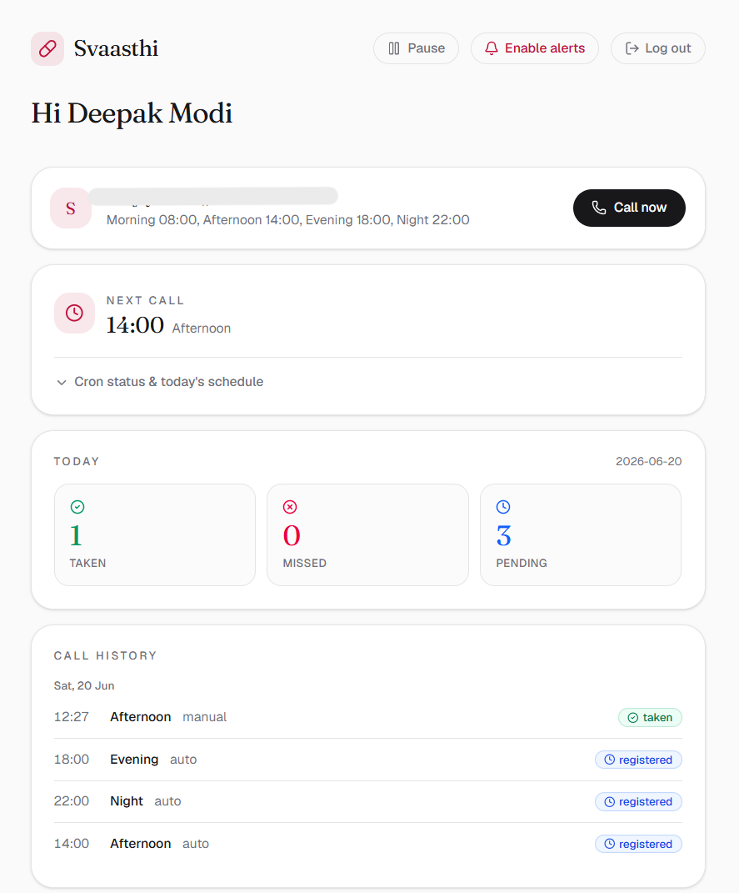

# Svaasthi

**Family-first medicine reminders.** Svaasthi calls your parents at medicine time with an AI voice agent, asks whether they've taken their dose, and alerts you on your phone the moment one is missed — nothing for them to install or learn.

Live: [svaasthi.vercel.app](https://svaasthi.vercel.app)



---

## How it works

```
 daily cron (00:15 IST)            Ringg AI                webhook / reconcile
 enqueue today's calls  ─────►  places the call  ─────►   maps result → dose
        │                       (scheduled_at)            status (taken / missed)
        ▼                                                         │
   doses table  ◄──────────────────────────────────────────────── ┘
        │
        ▼
  caregiver dashboard (SSR)  ──►  Web Push alert on a missed dose
```

1. A daily Vercel **cron** runs at **00:15 IST** and schedules every active patient's reminder calls for the day via Ringg's `scheduled_at`.
2. At each reminder time, **Ringg AI** calls the parent and runs a short conversation, classifying whether the medicine was taken (a custom analysis field).
3. The result comes back via a **webhook** (production) or is pulled by the dashboard's **auto-reconcile** on load. It's mapped to a dose status: `taken` / `not_taken` / `no_answer` / `voicemail` / `failed`.
4. On a **missed** dose, a **Web Push** notification is sent to the caregiver's subscribed browsers.
5. The caregiver sees everything on an **SSR dashboard** — today's status, the next call, the full call history, and a one-tap **pause/resume**.

## Features

- 📞 **Automated daily calls** at per-slot times (Morning / Afternoon / Evening / Night)
- 🔔 **Missed-dose Web Push alerts** to the caregiver
- ▶️ **Pause / Resume** — pausing also cancels today's already-scheduled calls on Ringg
- ⚡ **Call now** and **Run now** for on-demand calls / re-scheduling
- 📋 **Caregiver dashboard** — today's tally, next call, cron status, and call history
- 🔐 **Neon Auth** email/password sign-in, all data scoped per user

## Tech stack

| | |
|---|---|
| Framework | **Next.js 16** (App Router, Turbopack, SSR) · **React 19** |
| Database | **Neon** serverless Postgres (`@neondatabase/serverless`) |
| Auth | **Neon Auth** (`@neondatabase/auth`, Better Auth) |
| Voice calls | **Ringg AI** outbound calling API |
| Notifications | **Web Push** (VAPID, `web-push`) |
| Styling | Tailwind CSS v4, lucide-react, Fraunces + Geist fonts |
| Hosting | **Vercel** (cron + serverless functions) |

## Project structure

```
app/
  page.tsx              Dashboard (SSR) — guards, auto-reconcile, all sections
  hero.tsx              Landing hero for logged-out visitors
  dashboard-actions.tsx Client islands: Call now, Run now, Pause/Resume, Log out
  push-setup.tsx        Enable / test Web Push
  auth/  setup/         Sign-in and one-time patient setup
  api/
    call/               Manual "Call now" (uses the patient's own number)
    patients/           Create patient (POST) · pause-resume all (PATCH)
    cron/enqueue/       Daily cron (CRON_SECRET-guarded)
    cron/run/           "Run now" (session-guarded)
    ringg/webhook/      Receives Ringg call results (x-webhook-secret)
    push/subscribe|test Web Push subscription + test
    auth/[...path]/     Neon Auth handler
lib/
  constants.ts          IST, time helpers, dose-status groups (single source)
  db.ts                 Neon client (IPv6 fix + transient retry)
  ringg.ts              place / fetch-status / terminate calls + result mapping
  enqueue.ts            Shared enqueue logic (cron + Run now)
  push.ts               Web Push send + missed-dose notifier
  schema.ts             Database schema (ensureSchema)
  auth/                 Neon Auth server + client
proxy.ts                Next 16 middleware — protects /setup
vercel.json             Cron schedule
```

## Local development

```bash
npm install
cp .example.env .env.local   # then fill in real values
npm run dev                  # http://localhost:3000
```

### Environment variables

See `.example.env` for the full template. Required:

| Variable | What it is |
|---|---|
| `DATABASE_URL` | Neon pooled connection string |
| `NEON_AUTH_BASE_URL` | Neon Auth endpoint (Console → Auth) |
| `NEON_AUTH_COOKIE_SECRET` | `openssl rand -base64 32` |
| `RINGG_API_KEY` | Ringg workspace API key |
| `RINGG_AGENT_ID` | Ringg agent/assistant id |
| `RINGG_FROM_NUMBER_ID` | Ringg caller number id |
| `NEXT_PUBLIC_VAPID_PUBLIC_KEY` | Web Push public key (`npx web-push generate-vapid-keys`) |
| `VAPID_PRIVATE_KEY` | Web Push private key |
| `VAPID_SUBJECT` | A real contact email, e.g. `mailto:you@example.com` |
| `CRON_SECRET` | Guards the daily cron — use a strong random value |
| `RINGG_WEBHOOK_SECRET` | Guards the webhook — use a strong random value |
| `PUBLIC_BASE_URL` | Public app URL (prod only) so Ringg can call the webhook back |

> On localhost leave `PUBLIC_BASE_URL` empty — Ringg can't reach your machine, so the dashboard's auto-reconcile pulls call results instead of the webhook.

### Database

The schema (3 tables — `patients`, `reminders`, `doses` — plus `push_subscriptions`) is defined in `lib/schema.ts`. The deployed database is already initialized; to set up a fresh one, run `ensureSchema()` once against your `DATABASE_URL`.

## Ringg setup

1. Create an **agent/assistant** in the Ringg dashboard and copy its id → `RINGG_AGENT_ID`.
2. Get a **caller number id** (Numbers) → `RINGG_FROM_NUMBER_ID`.
3. *(Production)* Add a **webhook subscription**: `POST {PUBLIC_BASE_URL}/api/ringg/webhook`, events **Call Completed** + **Client Analysis Complete**, with a custom header `x-webhook-secret: <RINGG_WEBHOOK_SECRET>`. (The app also attaches this per-call automatically.)

> ⚠️ **Verified numbers (trial accounts).** On Ringg's trial/sandbox tier you can only call **OTP-verified** destination numbers — same as Twilio/Telnyx trials. To call a parent's phone, either verify that number in the Ringg dashboard once (OTP), or upgrade to a production plan that lifts the restriction. Calls to unverified numbers come back `failed`.

## Cron

`vercel.json` registers a daily job:

```json
{ "crons": [{ "path": "/api/cron/enqueue", "schedule": "45 18 * * *" }] }
```

`45 18 * * *` is **18:45 UTC = 00:15 IST**. Vercel sends `Authorization: Bearer <CRON_SECRET>` automatically. Test it manually (read-only) with:

```bash
curl "https://<app>/api/cron/enqueue?dry=1&secret=<CRON_SECRET>"
```

(Hobby plan allows one cron run per day, which this respects.)

## Deploy to Vercel

1. Push to GitHub and **Import** the repo at [vercel.com/new](https://vercel.com/new).
2. Add every environment variable above (use **strong** values for `CRON_SECRET` and `RINGG_WEBHOOK_SECRET`).
3. Deploy, then set `PUBLIC_BASE_URL` to the assigned `*.vercel.app` URL and redeploy.
4. In **Neon Console → Auth**, add the production domain as a trusted origin.

## Notes & limitations

- **India-only:** all times are `Asia/Kolkata` wall-clock (no DST), stored as `HH:MM`.
- **One patient per user** is the current product assumption.
- Pausing cancels *future* scheduling and today's still-pending Ringg calls, but a call already **ringing** at that instant isn't hung up (Ringg's documented behavior).
